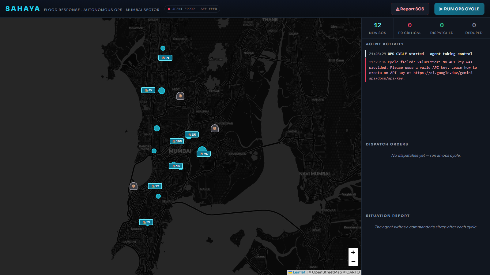
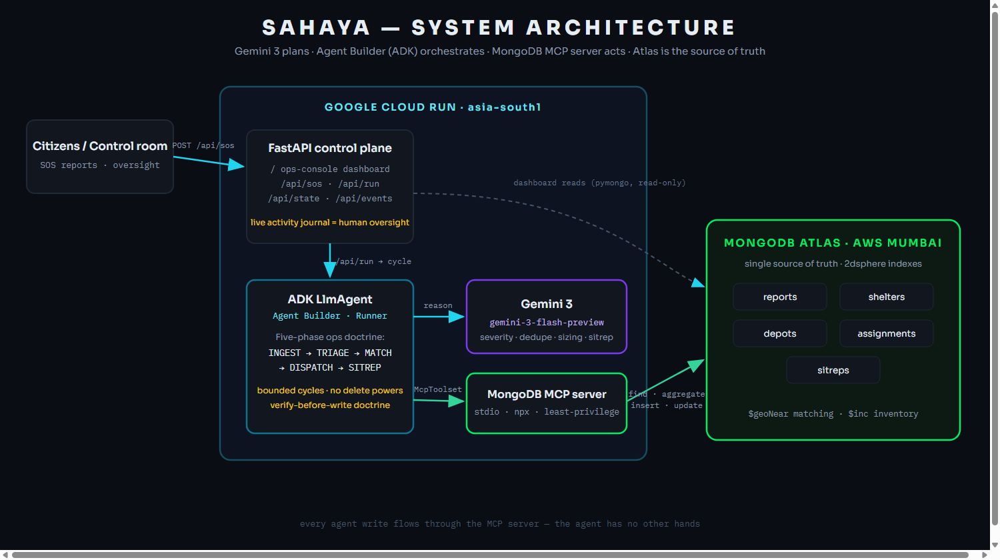

# SAHAYA — Autonomous Flood-Response Operations Agent

> *Sahaya* (सहाय): Sanskrit for "aid". An AI control-room operator that turns a chaotic
> flood SOS inbox into dispatched, tracked, inventory-accounted rescue operations —
> autonomously, under human oversight.

Built for the **Google Cloud Rapid Agent Hackathon 2026 — MongoDB track**.
**Gemini 3** plans · **Google Cloud Agent Builder (ADK)** orchestrates · the
**MongoDB MCP server** is the agent's hands · **MongoDB Atlas** is the source of truth.


-4285F4?logo=googlecloud&logoColor=white)




## The problem

During urban floods in India, coordination — not resources — is what fails. Control
rooms drown in thousands of unstructured SOS messages (calls, WhatsApp, social media)
that humans must triage, dedupe, match to shelters, and dispatch against finite depot
inventory. Minutes of latency cost lives. Mumbai alone sees this every single monsoon.

## What the agent does — one ops cycle

1. **INGEST** — pulls every unprocessed SOS report from Atlas
2. **TRIAGE** — assigns P0–P3 severity; detects duplicates ("building 4 Shivaji Nagar"
   reported three ways in two languages) and merges them
3. **MATCH** — `$geoNear` aggregations find the nearest shelter with free capacity and
   the nearest depot with sufficient stock
4. **DISPATCH** — writes assignment orders, decrements depot inventory, updates shelter
   occupancy, marks reports dispatched — real writes, visible live on the ops console
5. **SITREP** — writes a commander's situation report with risks and recommendations

Every database action flows through the **MongoDB MCP server** (`find`, `aggregate`,
`insert-many`, `update-many`) — least-privilege filtered so the agent can never delete
or drop anything. Every decision is journaled to a live activity feed.

## Architecture



See [docs/DESIGN.md](docs/DESIGN.md) for the full design, failure handling, and
human-in-the-loop controls; [docs/RESEARCH.md](docs/RESEARCH.md) for why this track.

## Run it yourself (5 minutes)

Prereqs: Python 3.12+, Node 20.19+, a free [MongoDB Atlas](https://cloud.mongodb.com)
cluster, a [Google AI Studio](https://aistudio.google.com) API key.

```bash
git clone https://github.com/bansalbhunesh/sahaya && cd sahaya
python -m venv .venv && . .venv/bin/activate   # Windows: .venv\Scripts\Activate.ps1
pip install -r requirements.txt
cp .env.example .env                            # fill in your two secrets
python -m app.seed                              # load the Mumbai monsoon scenario
uvicorn app.server:app --port 8080              # open http://localhost:8080
```

Click **▶ RUN OPS CYCLE** and watch the agent clear the board. Submit your own SOS
with **⚠ Report SOS** and run another cycle. `python -m app.smoke` runs the full
end-to-end check (seed → cycle → assert real mutations).

## Deploy (Cloud Run)

```bash
gcloud run deploy sahaya --source . --region asia-south1 --allow-unauthenticated \
  --set-env-vars GOOGLE_API_KEY=...,MDB_MCP_CONNECTION_STRING=...
```

## License

[MIT](LICENSE)
